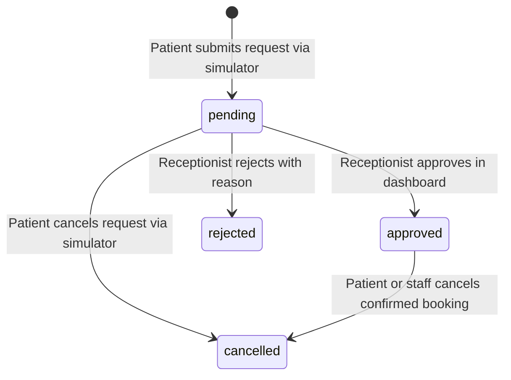

# Patient WhatsApp Requests & Receptionist Review Workflow

This document details the architecture, data flow, and state transitions for remote appointment booking requests initiated via the **Patient WhatsApp Simulator** and reviewed by front-desk staff in the **Clinix Receptionist Dashboard**.

---

## 1. End-to-End Workflow Diagram

```text
┌──────────────────────────────────────┐
│  Patient WhatsApp Simulator (5173)   │
│  - Doctor & 24h slot selection       │
│  - Patient details submission        │
└──────────────────┬───────────────────┘
                   │
                   │ POST /api/v1/patient-requests (source: 'simulator')
                   ▼
┌──────────────────────────────────────┐
│  FastAPI Backend (Port 8000)         │
│  - Creates REQ-XXXXXX (status: pending)
│  - Persists to Supabase / Excel      │
└──────────────────┬───────────────────┘
                   │
                   │ Polled every 8s / eventBus update
                   ▼
┌──────────────────────────────────────┐
│  Clinix Receptionist Dashboard (3000)│
│  - Header badge shows pending count  │
│  - Inbound Drawer reviews request    │
└──────────────────┬───────────────────┘
                   │
         ┌─────────┴─────────┐
         │ Staff Decision    │
         ▼                   ▼
┌─────────────────┐ ┌──────────────────┐
│ Approve Request │ │  Reject Request  │
└────────┬────────┘ └────────┬─────────┘
         │                   │
         ▼                   ▼
POST .../approve    POST .../reject
- Auto-registers    - Sets status
  patient             to 'rejected'
- Creates APT-XXXXXX- Patient notified
  with source='WHATSAPP' in simulator
- Calendar updates
```

---

## 2. Inbound Request State Machine

A patient request follows a strict 4-state lifecycle:



1. **`pending`**: Initial state upon submission. The requested dental slot is NOT yet reserved on the provider's active calendar, preventing lockouts.
2. **`approved`**: Receptionist approves the request. The backend atomically:
   - Registers a new patient record (or matches an existing one by phone/ID).
   - Verifies slot availability under an exclusive write lock.
   - Creates a confirmed appointment (`APT-XXXXXX`) tagged with `source: 'WHATSAPP'` and status `scheduled`.
   - Transitions request status to `approved` and records `appointment_id`.
3. **`rejected`**: Receptionist rejects the request (e.g. dentist in surgery). Notes are preserved so the patient simulator can suggest alternative slots.
4. **`cancelled`**: Can be cancelled at any time by the patient. If already approved, cancelling the request automatically cascades cancellation to the underlying appointment and frees the calendar slot.

---

## 3. Patient Experience in Simulator

### A. Immediate One-Click Cancellation
- Upon submitting a booking request, the patient sees a confirmation card displaying their **Request ID (`REQ-XXXXXX`)** and a **"Cancel Request"** button.
- Clicking the button prompts for confirmation and immediately executes `POST /api/v1/patient-requests/{id}/cancel`, updating status to `cancelled` without restarting the chat.

### B. Multi-Booking Schedule & Rescheduling
- Returning patients can enter their phone number or reference code (`APT-` or `REQ-`).
- The backend queries both `GET /api/v1/appointments` and `GET /api/v1/patient-requests` using phone digit-matching.
- The simulator merges all active bookings and renders individual cards for each appointment with date, 24h time, doctor, and status badge.
- The patient can select **"Change / Reschedule"** on any specific booking, select a new date and 24h slot, and confirm the reschedule via `POST /api/v1/appointments/{id}/reschedule`.

---

## 4. Receptionist Experience in Dashboard

1. **Top Nav Alert Badge (`BookingRequestBadge.tsx`)**:
   - Displays the real-time count of pending requests.
   - Pulses with an animated green pill when new requests arrive.
2. **Review Slide-Out Drawer (`BookingRequestPanel.tsx`)**:
   - Lists all inbound requests with patient name, phone, requested practitioner, date, 24h slot (`14:00 – 14:30`), and patient notes.
   - Provides 1-click **"Approve & Book"** and expandable **"Reject"** actions.
   - Emits `'appointment:created'` to the frontend `eventBus`, triggering instant calendar re-rendering without page reload.
