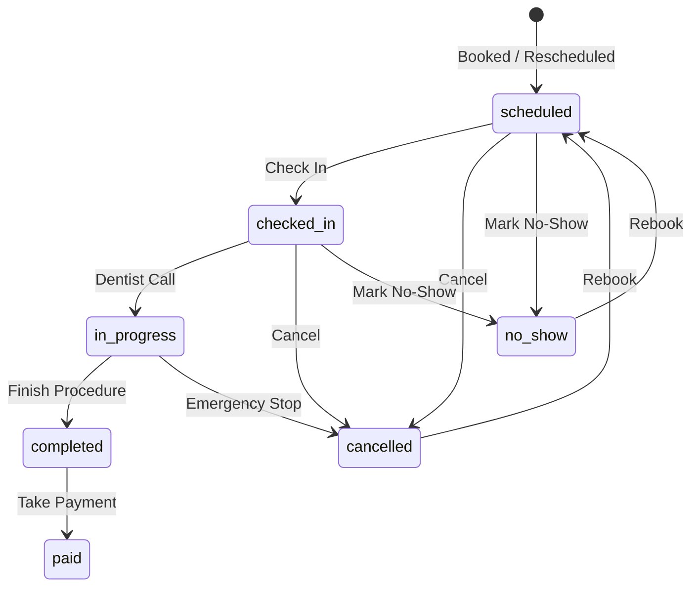

# Zendenta Frontend — Clinic Receptionist Management Dashboard

A modern, high-performance dental clinic management web application built with **Next.js 16 App Router (Turbopack)**, **Tailwind CSS v4**, and **TypeScript**. Built specifically for the **Clinic Receptionist** persona, Zendenta v3 streamlines patient check-ins, multi-dentist calendar scheduling, post-appointment billing, visit summaries, and queue management.

---

## 🌟 Key Features (Zendenta v3)

- 📅 **Interactive Provider Calendar (`/reservations`)**
  - Multi-dentist hourly view (9:00 AM – 5:00 PM) with dynamic provider columns directly fetched from the backend API.
  - Native HTML5 date picker and date navigation controls for instant jumping across days.
  - Bulletproof time parser supporting 24h (`09:00`), 12h (`09:00 AM`), and range strings with zero NaN positioning errors.
  - Comprehensive multi-identifier appointment matching (`dentist_id`, `dentistId`, `dentist_name`, `dentist`) ensuring all appointments are visible.
  - Drag-and-drop reschedule with automatic optimistic updates and backend persistence.
  - Deduplicated appointments with status-coded indicator badges (⏱ scheduled, ✓ checked-in, 🔵 in-progress, ✅ completed, 💰 paid).
  - Quick Day/Week views and log history auditing.
- 🩺 **Receptionist-First Permissions & Lifecycle Drawer**
  - **Single Source of Truth**: 7-state appointment machine (`scheduled`, `checked-in`, `in-progress`, `completed`, `paid`, `cancelled`, `no-show`).
  - **Clinical Separation**: Removed dentist-only medical checkup editing in favor of read-only clinical summaries and receptionist administrative notes.
  - Status-driven bottom action bar dynamically exposing valid receptionist actions.
- 📄 **Read-Only Visit Summary Panel**
  - Post-appointment clinical report displaying Chief Complaint, Diagnosis, Prescriptions (with pharmacy flags), Performed Treatments, Dentist Notes, and Itemized Billing.
- 💰 **Take Payment Workflow**
  - 480px modal dialog for recording payments via Cash, Card, Insurance, or Bank Transfer.
  - Automatic balance/change calculation and status transition from `completed` → `paid`.
- 🔄 **Reschedule & Cancel Dialogs**
  - Reschedule modal with slot chips, date picker, and dentist selection.
  - Cancel dialog with structured reason capture, patient notes, and one-click rebook offer.
- 🏃 **4-Step Walk-In Intake Drawer (`WalkInSheet`)**
  - Step 1: Search existing patient or quick register new patient.
  - Step 2: Assign provider with estimated lobby wait time.
  - Step 3: Select common treatments (Consultation, Emergency Extraction, Cleaning).
  - Step 4: Summary confirmation directly feeding into the active Waiting Room queue.
- 🏠 **Real-Time Clinic Overview (`/dashboard`)**
  - Status-aware **Up Next** card (replaces duplicate "Check In" with "Notify Dentist" once patient is checked in).
  - Lobby **Waiting Room** queue with color-coded duration alerts (amber at ≥ 10 min, red at ≥ 20 min).
  - Header `+ Walk-In Intake` button and Quick Action tiles for payments and reports.
- 👥 **Patients Directory (`/patients` & `/patients/[id]`)**
  - Searchable patient directory with gender filtering, instant CSV exports, and registration modal.
  - Individual patient profiles showing demographic details and historical visits.
- 📊 **Role-Partitioned Reports (`/reports`)**
  - Operational Reports (Appointments, Patients, Treatments) accessible to Receptionists.
  - Financial Reports (Revenue, Growth) restricted with `[Admin Only]` badges.

---

## 🏗️ Architecture: Server vs. Client Component Discipline

Zendenta strictly adheres to Next.js 16 Server Component discipline:

```text
Server Component (Static / Data Provider)
  └── Client Component "Shell" ('use client' - State & Handlers)
        └── Client Atoms (Buttons, Avatars, Modals, Forms)
```

| Route / File | Type | Purpose |
|---|---|---|
| `app/reservations/page.tsx` | **Server Component** (`force-static`) | Fetches initial providers & appointments; renders `<CalendarBoard />`. |
| `components/reservations/CalendarBoard.tsx` | **Client Component** (`'use client'`) | Interactive calendar grid, time calculation, modal controllers, deduplicated appointments. |
| `app/patients/page.tsx` | **Server Component** (`force-static`) | Supplies initial patient records; renders `<PatientsDirectory />`. |
| `components/patients/PatientsDirectory.tsx` | **Client Component** (`'use client'`) | Live debounced search, gender filtering, CSV export, and New Patient modal. |
| `components/patients/PatientRow.tsx` | **Client Component** (`'use client'`) | Client row rendering; prevents Server Component event handler warnings. |
| `components/patients/PatientAvatar.tsx` | **Client Component** (`'use client'`) | Handles `` state safely with fallback to colored initials. |
| `app/reports/page.tsx` | **Server Component** (`force-static`) | Pure static layout linking to operational reports. |

### ⚡ Lazy Loading Modals (`{ ssr: false }`)
All interactive sheets and dialogs are dynamically loaded on demand to minimize initial JavaScript bundle size:
- `ReservationDrawer`
- `VisitSummaryPanel`
- `TakePaymentDialog`
- `RescheduleDialog`
- `CancelDialog`
- `WalkInSheet`

---

## 📁 Directory Structure

```text
frontend/
├── app/
│   ├── layout.tsx                    # Root layout with <LayoutShell>
│   ├── page.tsx                      # Server redirect: / → /dashboard
│   ├── loading.tsx                   # Root loading skeleton
│   ├── globals.css                   # Tailwind v4 tokens & oklch color system
│   ├── dashboard/
│   │   └── page.tsx                  # Clinic overview, Up Next, Waiting Room, KPIs
│   ├── reservations/
│   │   ├── page.tsx                  # Server Component shell for calendar
│   │   └── loading.tsx               # Calendar schedule skeleton
│   ├── patients/
│   │   ├── page.tsx                  # Server Component shell for patients
│   │   ├── loading.tsx               # Patient directory skeleton
│   │   └── [id]/page.tsx             # Patient profile & history
│   ├── treatments/
│   │   ├── page.tsx                  # 3-column treatment procedures catalog
│   │   └── loading.tsx               # Treatments grid skeleton
│   ├── staff/
│   │   ├── page.tsx                  # Staff and practitioner directory
│   │   └── loading.tsx               # Staff skeleton
│   ├── reports/page.tsx              # Role-partitioned operational reports
│   ├── sales/page.tsx                # Billing records & revenue summary
│   ├── purchases/page.tsx            # Supply orders & vendor directory
│   ├── stocks/page.tsx               # Inventory stock & low-stock alerts
│   ├── payment-methods/page.tsx      # Payment methods configuration
│   ├── accounts/page.tsx             # Accounts overview
│   ├── peripherals/page.tsx          # Physical hardware asset tracking
│   └── support/page.tsx              # Support tickets & clinic contacts
├── components/
│   ├── appointments/
│   │   ├── CancelDialog.tsx          # Modal for cancelling appointments
│   │   ├── RescheduleDialog.tsx      # Modal with date & slot chips
│   │   ├── ReservationDrawer.tsx     # Status-driven appointment detail sheet
│   │   ├── VisitSummaryPanel.tsx     # Read-only post-appointment clinical report
│   │   └── WalkInSheet.tsx           # 4-step walk-in patient intake drawer
│   ├── dashboard/
│   │   └── DashboardQuickActions.tsx # Quick actions tiles (Intake, Pay, Reports)
│   ├── layout/
│   │   ├── Header.tsx                # Header with Receptionist profile badge
│   │   ├── LayoutShell.tsx           # Collapsible sidebar + header shell
│   │   └── Sidebar.tsx               # Navigation menu with role awareness
│   ├── patients/
│   │   ├── PatientAvatar.tsx         # Client avatar with onError initials fallback
│   │   ├── PatientRow.tsx            # Client patient row component
│   │   └── PatientsDirectory.tsx     # Client directory with search & filters
│   ├── payments/
│   │   └── TakePaymentDialog.tsx     # 480px payment intake modal
│   └── reservations/
│       └── CalendarBoard.tsx         # Client calendar board & deduplicated grid
├── lib/
│   ├── api-client.ts                 # Type-safe API client with offline fallbacks
│   ├── appointment-lifecycle.ts      # 7-state machine, transitions & action mapper
│   ├── constants.ts                  # Navigation configs & keyboard shortcuts
│   ├── formatters.ts                 # Currency and duration formatters
│   ├── mock-data.ts                  # Authoritative mock dataset for offline reliability
│   └── utils.ts                      # ClassName merger (clsx + tailwind-merge)
└── types/
    ├── api.ts                        # Backend DTOs & response schemas
    └── index.ts                      # Internal domain models
```

---

## 🔄 Appointment Lifecycle State Machine

Defined in `lib/appointment-lifecycle.ts`:



---

## 🚀 Getting Started

### Prerequisites

- **Node.js**: v18.18+ or v20+
- **pnpm**: v9+ (or `npm`)

### Installation & Run

```powershell
# Navigate to the frontend directory
cd frontend

# Install dependencies
pnpm install

# Start Next.js development server (Turbopack)
pnpm dev
```

The application will be running at [http://localhost:3000](http://localhost:3000).

### Build for Production

```powershell
pnpm build
pnpm start
```

---

## ⌨️ Global Keyboard Shortcuts

| Shortcut | Action |
|---|---|
| `⌘ B` / `Ctrl B` | Toggle Sidebar Collapse |
| `/` | Focus Header Search Bar |

---

## 🛡️ Offline-First Fallback Architecture

The frontend automatically attempts to connect to the FastAPI backend (`http://localhost:8000`). If the backend is offline or an endpoint is unreachable, the application gracefully falls back to the curated in-memory datasets (`lib/mock-data.ts`) without throwing unhandled console errors.
