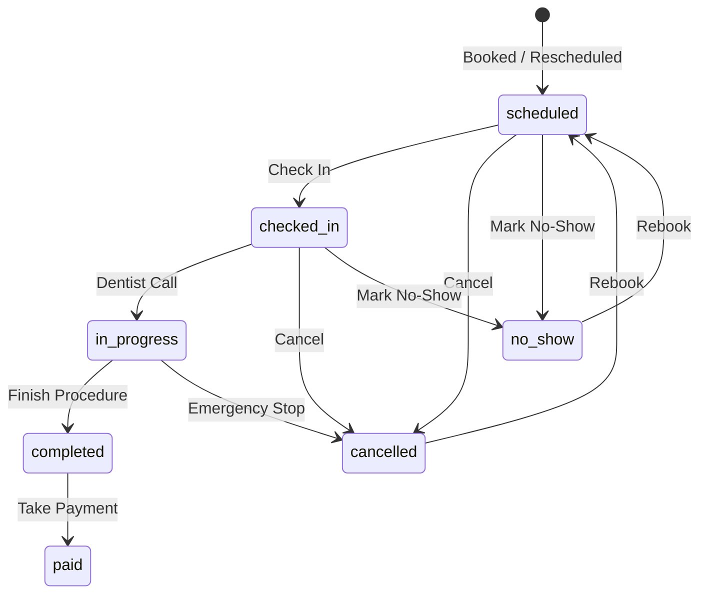

# Clinix Frontend — Clinic Receptionist Management Dashboard

A modern, high-performance dental clinic management web application built with **Next.js 16 App Router (Turbopack)**, **Tailwind CSS v4**, and **TypeScript**. Built specifically for the **Clinic Receptionist** persona, Clinix streamlines patient check-ins, multi-dentist calendar scheduling, post-appointment billing, visit summaries, and queue management.

---

## 🌟 Key Features (Clinix / Zendenta v3)

- 🕒 **Strict 24-Hour Time Format Standard (`HH:mm`)**
  - All time displays, calendar axes (`09:00` to `00:00`), appointment cards (`09:00 › 10:00`, `14:30 › 15:30`), drawers, summaries, operating timings (`09:00 - 00:00`), and bot timestamps strictly adhere to 24-hour formatting.
- ⚡ **Next.js Reverse Proxy & Zero-CORS Architecture**
  - Server-side rewrites in `next.config.mjs` route `/api/:path*` to `http://127.0.0.1:8000/api/:path*`.
  - Same-origin relative API requests (`API_URL = ''`) in the browser eliminate CORS preflight latency, IPv6/IPv4 `localhost` resolution mismatches, and connection errors.
- 💬 **Inbound WhatsApp Booking Requests Review (`features/whatsapp-agent`)**
  - **Header Alert Capsule (`BookingRequestBadge.tsx`)**: Real-time badge in the top navigation showing pending inbound patient requests with pulse animation.
  - **Slide-out Review Drawer (`BookingRequestPanel.tsx` & `BookingRequestCard.tsx`)**: Front-desk staff can inspect patient details, visit reason, requested doctor, date, and 24h time slot.
  - **1-Click Staff Approval / Rejection**: Approving a request automatically registers the patient, creates a confirmed appointment with `source: 'WHATSAPP'`, updates the calendar via `eventBus`, and removes it from the pending review queue.
- 🚶 **Intelligent Walk-In Intake & On-Duty Roster (`features/walk-in`)**
  - **Patient Autocomplete (`PatientAutocomplete.tsx`)**: Live search querying `/api/v1/patients/lookup` by phone or name. Existing patient records automatically populate demographics, medical notes, and allergies.
  - **On-Duty Availability Grid (`DentistAvailabilityGrid.tsx`)**: Real-time shift roster showing active doctors, booked intervals, open 24h slots, and a **"Recommended (Shortest Wait)"** badge.
  - Generates walk-in appointments tagged with `source: 'WALK_IN'` and status `checked-in` feeding directly into the lobby queue.
- 📅 **Interactive Provider Calendar (`/reservations`)**
  - Multi-dentist hourly view with dynamic provider columns directly fetched from the backend API (`DEN-000001` Dr. Sarah Wilson, `DEN-000002` Dr. Michael Chen, `DEN-000003` ROHAN).
  - **Timezone-Safe Date Navigation**: Uses local calendar coordinates (`getLocalDateString()`), eliminating UTC day-shift drift across late-night/early-morning hours.
  - **24-Hour Time & Collision Engine (`lib/calendar-collision.ts` & `lib/formatters.ts`)**: 24h left-axis marks (`09:00` - `00:00`), composite range formatting (`formatTimeRange24`), zero NaN positioning errors, and accurate duration scaling.
  - **Live Synchronization Bus**: Listens to and dispatches `'appointment-created'` and `'appointment-updated'` DOM events, instantly updating the calendar upon booking, walk-in intake, or status changes.
  - Comprehensive multi-identifier appointment matching (`dentist_id`, `dentistId`, `dentist_name`, `dentist`) ensuring all appointments are visible.
  - Drag-and-drop reschedule with automatic optimistic updates and backend persistence (`POST /api/v1/appointments/{id}/reschedule`).
  - Deduplicated appointments with status-coded indicator badges (⏱ scheduled, ✓ checked-in, 🔵 in-progress, ✅ completed, 💰 paid).
  - Direct-access operational mode: zero login friction for receptionists.
- 🩺 **Receptionist-First Permissions & Lifecycle Drawer**
  - **Single Source of Truth**: 7-state appointment machine (`scheduled`, `checked-in`, `in-progress`, `completed`, `paid`, `cancelled`, `no-show`).
  - **Clinical Separation**: Removed dentist-only medical checkup editing in favor of read-only clinical summaries and receptionist administrative notes.
  - Status-driven bottom action bar dynamically exposing valid receptionist actions.
- 📄 **Read-Only Visit Summary Panel**
  - Post-appointment clinical report displaying Chief Complaint, Diagnosis, Prescriptions (with pharmacy flags), Performed Treatments, Dentist Notes, and Itemized Billing in 24-hour time.
- 💰 **Take Payment Workflow**
  - 480px modal dialog for recording payments via Cash, Card, Insurance, or Bank Transfer.
  - Automatic balance/change calculation and status transition from `completed` → `paid`.
- 🔄 **Reschedule & Cancel Dialogs**
  - Reschedule modal with 24h slot chips, date picker, and dentist selection.
  - Cancel dialog with structured reason capture, patient notes, and one-click rebook offer.
- 🏠 **Real-Time Clinic Overview (`/dashboard`)**
  - Status-aware **Up Next** card (replaces duplicate "Check In" with "Notify Dentist" once patient is checked in).
  - Lobby **Waiting Room** queue with color-coded duration alerts (amber at ≥ 10 min, red at ≥ 20 min).
  - Header `+ Walk-In Intake` button and Quick Action tiles for payments and reports.
- 👥 **Patients Directory (`/patients` & `/patients/[id]`)**
  - Searchable patient directory with gender filtering, instant CSV exports, and registration modal.
  - Individual patient profiles showing demographic details and historical visits.
- 📊 **Role-Partitioned Reports (`/reports`)**
  - Operational Reports (Appointments, Patients, Treatments) accessible to Receptionists.
  - Financial Reports (Revenue, Growth) restricted with `[Admin Only]` badges.

---

## 🏗️ Architecture: Server vs. Client Component Discipline

Zendenta strictly adheres to Next.js 16 Server Component discipline:

```text
Server Component (Static / Data Provider)
  └── Client Component "Shell" ('use client' - State & Handlers)
        └── Client Atoms (Buttons, Avatars, Modals, Forms)
```

| Route / File | Type | Purpose |
|---|---|---|
| `app/reservations/page.tsx` | **Server Component** (`force-static`) | Fetches initial providers & appointments; renders `<CalendarBoard />`. |
| `components/reservations/CalendarBoard.tsx` | **Client Component** (`'use client'`) | Interactive calendar grid, time calculation, modal controllers, deduplicated appointments. |
| `app/patients/page.tsx` | **Server Component** (`force-static`) | Supplies initial patient records; renders `<PatientsDirectory />`. |
| `components/patients/PatientsDirectory.tsx` | **Client Component** (`'use client'`) | Live debounced search, gender filtering, CSV export, and New Patient modal. |
| `components/patients/PatientRow.tsx` | **Client Component** (`'use client'`) | Client row rendering; prevents Server Component event handler warnings. |
| `components/patients/PatientAvatar.tsx` | **Client Component** (`'use client'`) | Handles `` state safely with fallback to colored initials. |
| `app/reports/page.tsx` | **Server Component** (`force-static`) | Pure static layout linking to operational reports. |

### ⚡ Lazy Loading Modals (`{ ssr: false }`)
All interactive sheets and dialogs are dynamically loaded on demand to minimize initial JavaScript bundle size:
- `ReservationDrawer`
- `VisitSummaryPanel`
- `TakePaymentDialog`
- `RescheduleDialog`
- `CancelDialog`
- `WalkInSheet`

---

## 📁 Directory Structure

```text
frontend/
├── app/
│   ├── layout.tsx                    # Root layout with <LayoutShell>
│   ├── page.tsx                      # Server redirect: / → /dashboard
│   ├── loading.tsx                   # Root loading skeleton
│   ├── globals.css                   # Tailwind v4 tokens & oklch color system
│   ├── dashboard/
│   │   └── page.tsx                  # Clinic overview, Up Next, Waiting Room, KPIs
│   ├── reservations/
│   │   ├── page.tsx                  # Server Component shell for calendar
│   │   └── loading.tsx               # Calendar schedule skeleton
│   ├── patients/
│   │   ├── page.tsx                  # Server Component shell for patients
│   │   ├── loading.tsx               # Patient directory skeleton
│   │   └── [id]/page.tsx             # Patient profile & history
│   ├── treatments/
│   │   ├── page.tsx                  # 3-column treatment procedures catalog
│   │   └── loading.tsx               # Treatments grid skeleton
│   ├── staff/
│   │   ├── page.tsx                  # Staff and practitioner directory
│   │   └── loading.tsx               # Staff skeleton
│   ├── reports/page.tsx              # Role-partitioned operational reports
│   ├── sales/page.tsx                # Billing records & revenue summary
│   ├── purchases/page.tsx            # Supply orders & vendor directory
│   ├── stocks/page.tsx               # Inventory stock & low-stock alerts
│   ├── payment-methods/page.tsx      # Payment methods configuration
│   ├── accounts/page.tsx             # Accounts overview
│   ├── peripherals/page.tsx          # Physical hardware asset tracking
│   └── support/page.tsx              # Support tickets & clinic contacts
├── components/
│   ├── appointments/
│   │   ├── CancelDialog.tsx          # Modal for cancelling appointments
│   │   ├── RescheduleDialog.tsx      # Modal with date & slot chips
│   │   ├── ReservationDrawer.tsx     # Status-driven appointment detail sheet
│   │   ├── VisitSummaryPanel.tsx     # Read-only post-appointment clinical report
│   │   └── WalkInSheet.tsx           # 4-step walk-in patient intake drawer
│   ├── dashboard/
│   │   └── DashboardQuickActions.tsx # Quick actions tiles (Intake, Pay, Reports)
│   ├── layout/
│   │   ├── Header.tsx                # Header with Receptionist profile badge
│   │   ├── LayoutShell.tsx           # Collapsible sidebar + header shell
│   │   └── Sidebar.tsx               # Navigation menu with role awareness
│   ├── patients/
│   │   ├── PatientAvatar.tsx         # Client avatar with onError initials fallback
│   │   ├── PatientRow.tsx            # Client patient row component
│   │   └── PatientsDirectory.tsx     # Client directory with search & filters
│   ├── payments/
│   │   └── TakePaymentDialog.tsx     # 480px payment intake modal
│   └── reservations/
├── features/
│   ├── walk-in/
│   │   ├── components/
│   │   │   ├── PatientAutocomplete.tsx   # Live patient lookup with debounced autocomplete
│   │   │   └── DentistAvailabilityGrid.tsx # Real-time provider shift roster with 24h slots
│   │   ├── services/walk-in.service.ts   # Walk-in booking orchestration
│   │   └── types.ts                      # Walk-in domain interfaces
│   └── whatsapp-agent/
│       ├── components/
│       │   ├── BookingRequestBadge.tsx   # Top nav badge with pending request count & pulse
│       │   ├── BookingRequestPanel.tsx   # Inbound request review slide-out drawer
│       │   └── BookingRequestCard.tsx    # Request inspection card with 1-click approve/reject
│       ├── hooks/useBookingRequests.ts   # Polling hook with real-time eventBus sync
│       ├── services/booking-request.service.ts # Remote request submission & approval API
│       └── types.ts                      # Booking request data models
├── lib/
│   ├── api-client.ts                 # Type-safe API client with offline fallbacks
│   ├── appointment-lifecycle.ts      # 7-state machine, transitions & action mapper
│   ├── calendar-collision.ts         # Collision detection, time parsing, and slot stacking algorithms
│   ├── constants.ts                  # Navigation configs & keyboard shortcuts
│   ├── formatters.ts                 # Currency and duration formatters
│   ├── mock-data.ts                  # Authoritative mock dataset for offline reliability
│   └── utils.ts                      # ClassName merger (clsx + tailwind-merge)
└── types/
    ├── api.ts                        # Backend DTOs & response schemas
    └── index.ts                      # Internal domain models
```

---

## 🔄 Appointment Lifecycle State Machine

Defined in `lib/appointment-lifecycle.ts`:



---

## 🚀 Getting Started

### Prerequisites

- **Node.js**: v18.18+ or v20+
- **pnpm**: v9+ (or `npm`)

### Installation & Run

```powershell
# Navigate to the frontend directory
cd frontend

# Install dependencies
pnpm install

# Start Next.js development server (Turbopack)
pnpm dev
```

The application will be running at [http://localhost:3000](http://localhost:3000).

### Build for Production

```powershell
pnpm build
pnpm start
```

---

## ⌨️ Global Keyboard Shortcuts

| Shortcut | Action |
|---|---|
| `⌘ B` / `Ctrl B` | Toggle Sidebar Collapse |
| `/` | Focus Header Search Bar |

---

## 🛡️ Offline-First Fallback Architecture

The frontend automatically attempts to connect to the FastAPI backend (`http://localhost:8000`). If the backend is offline or an endpoint is unreachable, the application gracefully falls back to the curated in-memory datasets (`lib/mock-data.ts`) without throwing unhandled console errors.

---

## ⚡ Next.js API Reverse Proxy & Zero-CORS Architecture

In `next.config.mjs`, a server-side rewrite rules proxies all `/api/:path*` requests to the FastAPI backend on `http://127.0.0.1:8000/api/:path*`:

```javascript
async rewrites() {
  return [
    {
      source: '/api/:path*',
      destination: 'http://127.0.0.1:8000/api/:path*',
    },
  ]
}
```

- **Client Benefit**: The browser makes same-origin requests (`/api/v1/...`), avoiding CORS preflight checks, IPv6 `[::1]` resolution mismatches on Windows, and cross-origin fetch failures.
- **Server Benefit**: Server Components (SSR) connect directly to `http://127.0.0.1:8000`.

---

## 🕒 24-Hour Time Format Standard

All date and time values across the frontend adhere strictly to 24-hour formatting (`HH:mm`):
- **Calendar Left Axis**: `09:00` to `00:00`
- **Appointment Cards**: `09:00 › 10:00`, `14:30 › 15:30`
- **Clinic Operating Timings**: `09:00 - 00:00` (weekdays), `10:00 - 20:00` (weekends)
- **Formatting Utilities**: Centralized in `lib/formatters.ts` via `formatHour`, `formatTimeTo24`, and `formatTimeRange24`.

