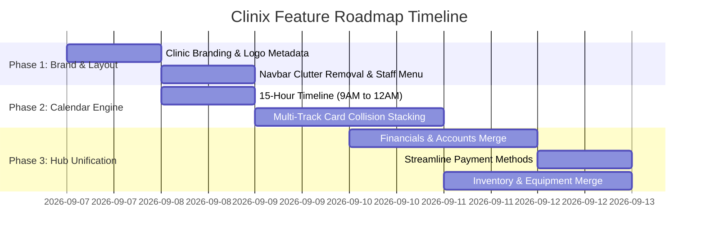

# Master Implementation & Migration Schedule (Auth-Free Roadmap)

## 1. Executive Summary & Phased Roadmap
This master schedule orchestrates the remaining future feature upgrades for **Clinix (Zendenta)** into 3 tightly scoped, zero-regression execution phases.

---

## 2. Phase-by-Phase Execution Breakdown

### 🔷 Phase 1: Brand Identity & Minimalist Navigation
- **Scope**:
  - Implement dynamic `ClinicLogo`, SVG assets, and centralized `ClinicMetadata` ([Plan 01](./01_clinic_branding_logo_address.md)).
  - Clean up global top header; construct comprehensive `MyAccountMenu` staff profile & station switcher ([Plan 02](./02_navbar_and_header_simplification.md)).
- **Deliverables**:
  - `frontend/components/brand/ClinicLogo.tsx`
  - `frontend/components/layout/MyAccountMenu.tsx`
  - Streamlined `frontend/components/layout/Header.tsx`

---

### 🔷 Phase 2: High-Performance Calendar Engine Upgrades
- **Scope**:
  - Extend calendar schedule from 9:00 AM to 12:00 AM Midnight (15 operational hours) ([Plan 04](./04_reservations_timeline_9am_to_12am.md)).
  - Implement multi-track interval conflict algorithm for overlapping cards, simultaneous walk-ins, and distinct cancelled slot ghosting ([Plan 03](./03_reservations_calendar_overlap_and_stacking.md)).
- **Deliverables**:
  - `frontend/lib/calendar-collision.ts`
  - Updated `frontend/components/reservations/CalendarBoard.tsx` with auto-scrolling time indicator and collision geometry.

---

### 🔷 Phase 3: Module Unification & Clutter Elimination
- **Scope**:
  - Merge `/sales` and `/accounts` into high-impact `/financials` hub with KPIs, cashflow waterfall, and itemized invoice ledgers ([Plan 05](./05_merged_financials_and_accounts_hub.md)).
  - Remove standalone `/payment-methods` route; embed payment mode controls directly into checkout drawer ([Plan 06](./06_payment_methods_streamlining.md)).
  - Merge `/stocks` and `/peripherals` into unified `/inventory` hub with consumables and medical equipment tabs ([Plan 07](./07_unified_inventory_and_equipment_hub.md)).
- **Deliverables**:
  - `frontend/app/financials/page.tsx` & `frontend/components/financials/*`
  - `frontend/app/inventory/page.tsx` & `frontend/components/inventory/*`
  - Route redirects in `/sales`, `/accounts`, `/payment-methods`, `/stocks`, and `/peripherals`.

---

## 3. Backward Compatibility & Zero-Regression Invariants

1. **Direct Access Receptionist Mode**: Zero login walls, token expirations, or session barriers during clinical reception workflows.
2. **Legacy Route Safety**: All deprecated paths (`/sales`, `/accounts`, `/stocks`, `/peripherals`, `/payment-methods`) issue permanent 301/307 redirects to their unified parent destinations so bookmarks and external links never break.
3. **Dual-Repository Integrity**: Database schemas for both **Supabase PostgreSQL** and **OpenPyXL Excel** remain in lockstep.
4. **No Mock Data Principle**: All newly merged views fetch 100% live data through FastAPI REST endpoints with zero hardcoded mock arrays.
